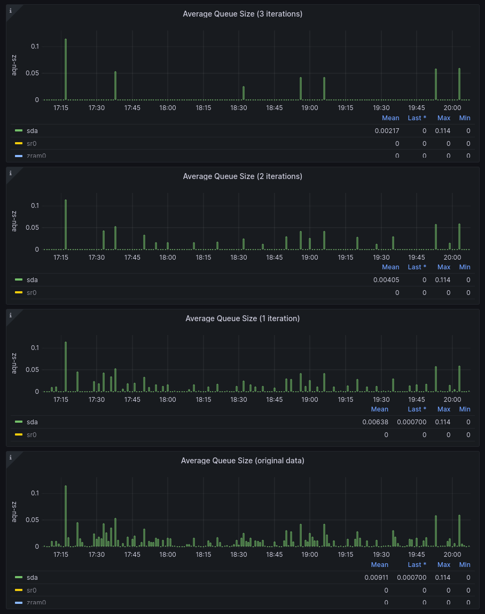

### Peak/Spike Detector Library

#### NB: This is not yet production ready. It is still undergoing heavy development and testing.

Inspired by the `LeetCode` "Find Mountain Peaks" problem.

I dug into this problem, including the literature, on the general issue of peak detection. \
I saw a number of continuous math approaches, as well as ones based on sorting the dataset.

My solution is discrete math/combinatorial in nature. It exhaustively identifies all peaks \
in a 3 sample cluster, then iteratively merges all such clusters until only a single cluster \
remains, and which has all the peaks identified. From what I've seen, many naive `LeetCode` \
solutions do not account for the fact that a single peak can extend across several samples.

The algorithm can be applied iteratively, over time culling more and more lower-order peaks \
from the result. If applied iteratively, in the limit the algorithm will produce just a single \
peak, assuming one exists in the data.

The benefit of applying the algorithm iteratively, is that it allows one to select higher-order \
peaks for, e.g., as candidates for alerting, without expressly specifying a static threshold. \
The algorithm will naturally cull all lower order peaks, leaving only those which substantially \
rise above the noise.

Now, there is still a tunable here, namely the number of iterations. And while this tunable does \
need some thought, even blindly setting it at two iterations, will produce more reliable results \
than an arbitrarily selected static threshold. For example, if the signal mean shifts substantially, \
then static threshold will become useless, because now most of the signal could either be above \
or below it. With this approach, we're immune to the variations in the signal mean: the peaks will \
be identified irrespective of how the signal shifts about the mean.

